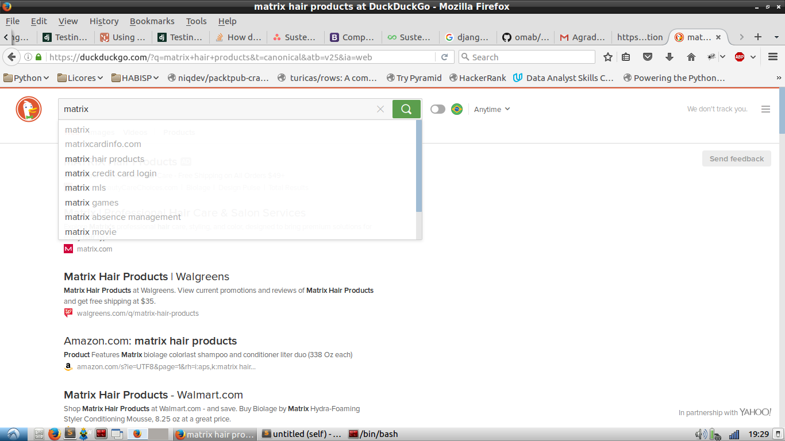

# README #

#### Projeto para o processo seletivo da Loja Integrada. ####

### De onde saiu esse nome de repositório? ###

O nome do repositório peguei da seguinte forma: escrevi "matrix" no duckduckgo.com e peguei a primeira opção de autocomplete que não fosse uma url.
O print disso está no repositório no arquivo de nome: de_onde_tirei_o_nome.png
Exibido - eu espero que markdown não me deixe na mão - a seguir:  

- - -

### Especificação ###

Dada uma matriz de tamanho MxN na qual cada elemento represente um pixel, crie
um programa que leia uma sequência de comandos e os interprete manipulando a
matriz de acordo com a descrição abaixo de cada comando.  

Para rodar o projeto, simplesmente execute:

	python matrix_hair

Ou diretamente o arquivo `__main__.py`.  

#### Comandos ####

I M N  
Cria uma nova matriz MxN. Todos os pixels são brancos (O).

C  
Limpa a matriz. O tamanho permanece o mesmo. Todos os pixels ficam brancos (O).

L X Y C  
Colore um pixel de coordenadas (X,Y) na cor C.

V X Y1 Y2 C  
Desenha um segmento vertical na coluna X nas linhas de Y1 a Y2 (intervalo
inclusivo) na cor C.

H X1 X2 Y C  
Desenha um segmento horizontal na linha Y nas colunas de X1 a X2 (intervalo
inclusivo) na cor C.

K X1 Y1 X2 Y2 C  
Desenha um retangulo de cor C. (X1,Y1) é o canto superior esquerdo e (X2,Y2) o
canto inferior direito.

F X Y C  
Preenche a região com a cor C. A região R é definida da seguinte forma:
O pixel (X,Y) pertence à região. Outro pixel pertence à região, se e somente se,
ele tiver a mesma cor que o pixel (X,Y) e tiver pelo menos um lado em comum com
um pixel pertencente à região.

S name  
Escreve a imagem em um arquivo de nome name.

X  
Encerra o programa.

#### Considerações ####

Comandos diferentes de I, C, L, V, H, K, F, S e X devem ser ignorados.

- - -

### Requisitos ###

* Python 3.5
* PIL/Pillow
# TODO: verificar se há mais requisitos

- - -

### Instalação ###

# TODO: verificar se vai continuar assim
Por enquanto é só rodar o script mesmo.

- - -

### Testes ###

Os testes foram implementados usando a biblioteca padrão `unittest` procurando seguir o princípio de testar o que é relevante, e não simplesmente obter 100% de cobertura - não que sejam coisas excludentes.  
Para rodar os testes, é só executar na raiz do projeto:

> python3.5 -m unittest
> 

- - -

